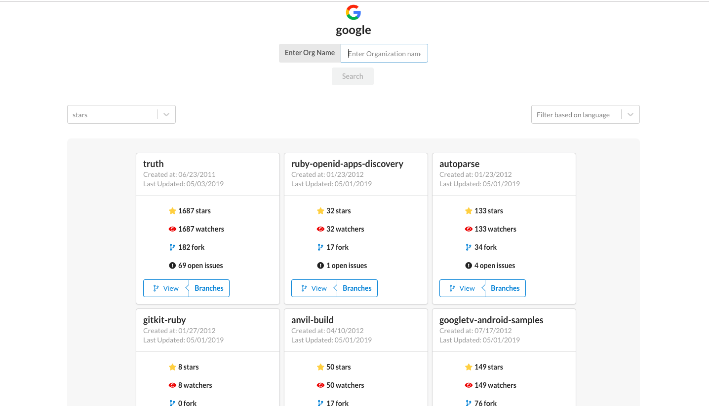

## Basic Overview

Fetch repos from relevant organisations using the Github api. Built using React, Redux, Styled-components, Webpack.

This project is hosted at [https://angry-minsky-244a30.netlify.com/](https://angry-minsky-244a30.netlify.com/)

- Pagination implemented
- Filter and sort added

## Available Scripts

In the project directory, you can run:

### `npm install`

installs dependencies and dev dependencies 

### `npm start`

Runs the app in the development mode. 
Open [http://localhost:3001](http://localhost:3001) to view it in the browser.

### `npm run test`

Launches the test runner.

### `npm run build`

Builds the app for production to the `dist` folder

## Screens

#### TODO

- Better test coverage
- implementing code-splitting
